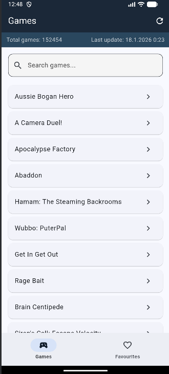
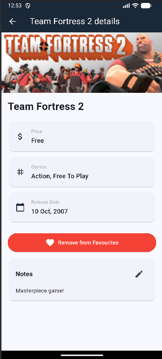
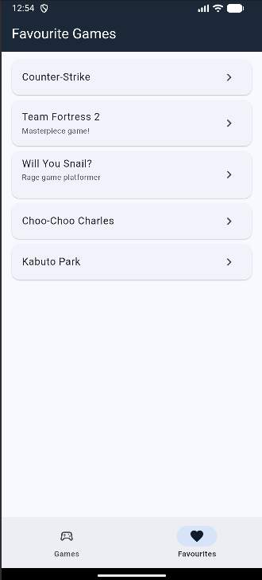

# Steam Tracker

Mobilní aplikace pro sledování her ze Steamu.

Aplikace načítá aktuální data přímo ze **Steam REST API** a ukládá je do **lokální SQLite databáze**.

## Features list
- Procházet kompletní katalog her dostupných na platformě Steam
- Vyhledávat pomocí názvu hry
- Zobrazit detailní informace o každé hře
- Přidávat hry do seznamu oblíbených
- Ukládat poznámky k oblíbeným hrám

## Screenshoty

